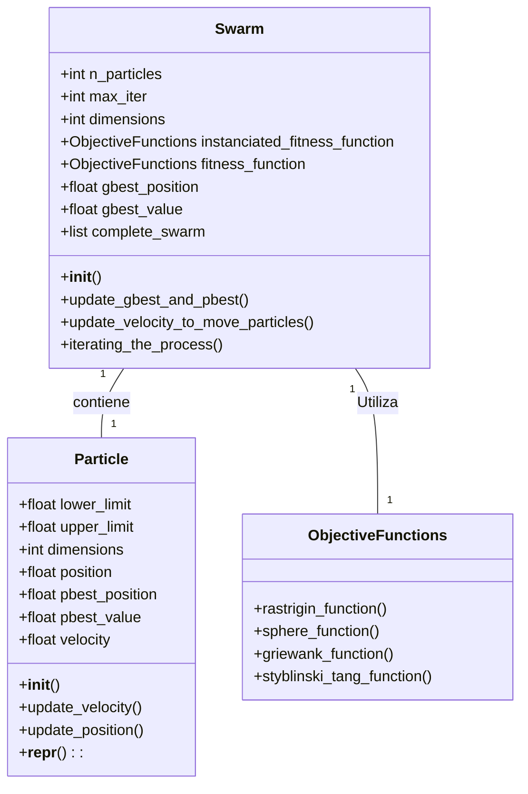

# Particle Swarm Optimization (PSO) - Python Implementation

## Descripción

Este proyecto implementa el algoritmo **Particle Swarm Optimization (PSO)** desde cero utilizando **Programación Orientada a Objetos (POO)** en Python.  
El sistema permite optimizar diferentes funciones objetivo clásicas de benchmarking de optimización matemática.

El diseño es modular, claro y extensible, facilitando futuras mejoras como nuevas funciones, topologías o estrategias de actualización de partículas.

---

     

## Características

- Implementación de PSO con:
  - Configuración flexible de partículas, dimensiones, límites y funciones.
  - Actualización de velocidades y posiciones por iteración.
  - Condiciones de parada: número de iteraciones, estancamiento y límite de tiempo.

- **Funciones objetivo incluidas**:
  - Rastrigin
  - Sphere
  - Griewank
  - Styblinski-Tang

- Visualización 2D y 3D de la posición de las partículas (en desarrollo en `utils.py`).

- Tests unitarios básicos incluidos (`tests/test_swarm.py`).

---

## Estructura del proyecto
```
- pso_project/
-│         
-├── PSO/                      # Proyecto Django (configuración principal)
-│ ├── __init__.py             # Marca este directorio como un paquete Python
-│ ├── asgi.py                 # Configuración para ASGI (servidores asíncronos)
-│ ├── settings.py             # CONFIGURACIÓN principal del proyecto Django
-│ ├── urls.py                 # Rutas a nivel proyecto (distribuye a apps)
-│ ├── wsgi.py                 # Configuración para WSGI (servidores como Gunicorn)
-│ 
-├── PSOApp/                 # Aplicación Django (donde está tu lógica PSO)
-│ ├── __init__.py                 # Marca como paquete Python
-│ ├── admin.py                   # Registro de modelos para el panel admin
-│ ├── apps.py                    # Configuración de la app en Django
-│ ├── models.py                  # Modelos de base de datos (si usas ORM)
-│ ├── urls.py                    # Rutas específicas de esta app
-│ ├── views.py                   # Vistas: lógica que responde a peticiones web
-│ │
-│ ├── migrations/                # Archivos de migración de la base de datos
-│ 
-│  ├── src/
-│   ├── __init__.py               
-│   ├── particle.py              
-│   ├── swarm.py                
-│   ├── objective_functions.py   
-│   ├── utils.py                 
-│   └── main.py                  
-│ 
-│ ├── static/                    # Archivos estáticos locales a esta app
-│ ├── templates/                 # HTMLs (renderizados desde las vistas)
-│ └── tests/                     # Pruebas unitarias de esta app

├── static/                 # Archivos estáticos (CSS, JS, imágenes)
├── db.sqlite3              # Base de datos SQLite por defecto de Django
├── manage.py               # Script principal para ejecutar comandos Django
├── pyvenv.cfg              # Configuración del entorno virtual de Python
└── README.md               # Documentación del proyecto
```

---

## Requisitos

- Python 3.8+
- Numpy
- Matplotlib (para visualizaciones)
- Pytest (para correr tests)

Instalación de dependencias (opcional):

```bash
pip install numpy matplotlib pytest
```
```bash
pip install django
```

## Ejecución

Para correr el ejemplo principal:

```bash
python -m src.main
```

Esto inicializa varios enjambres con diferentes funciones objetivo y dimensiones, ejecutando PSO para cada uno.

## Tests
Para correr los tests unitarios:
```cmd
pytest tests/test_swarm.py
```
o
```cmd
python -m tests.test_swarm
```
Esto valida:

Correcta ejecución de PSO en:

- 1 dimensión (funciones: Rastrigin, Sphere, Griewank, Styblinski-Tang).

- 2 dimensiones (funciones: Rastrigin, Sphere, Griewank, Styblinski-Tang).

Convergencia esperada (mínimos locales o globales conocidos).

## Visualización

Las funciones de visualización están disponibles en `utils.py`:

```python
plot_2d_particles(swarm.complete_swarm, swarm.fitness_function, lower_limit, upper_limit)
plot_3d_surface_with_particles(swarm.complete_swarm, swarm.fitness_function, lower_limit, upper_limit)
```
Estas permiten graficar:

- La posición actual de las partículas en el espacio de búsqueda.
- La función objetivo evaluada en 2D o 3D junto a las partículas.

## Fuentes de consulta: 
https://en.wikipedia.org/wiki/Particle_swarm_optimization
